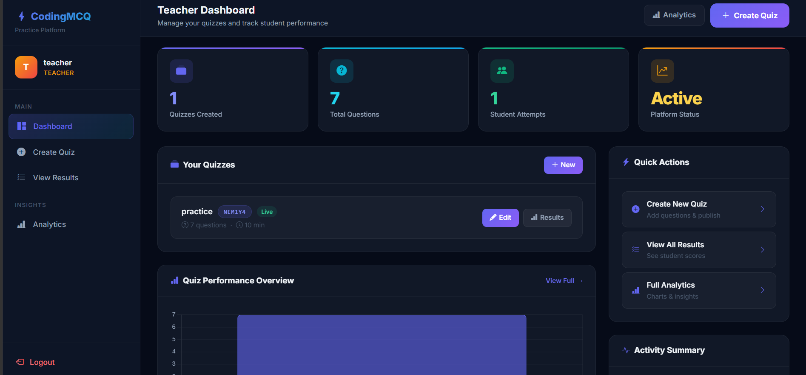
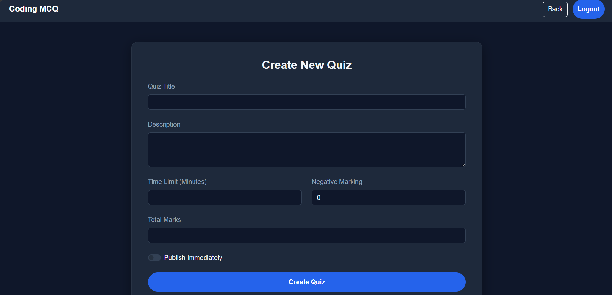
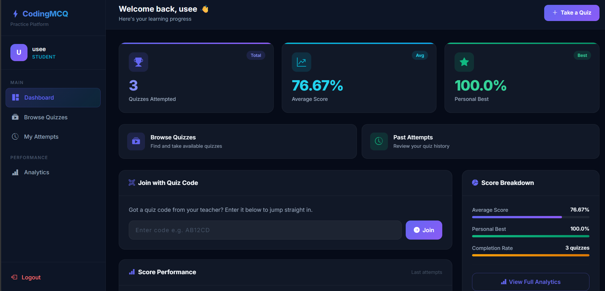
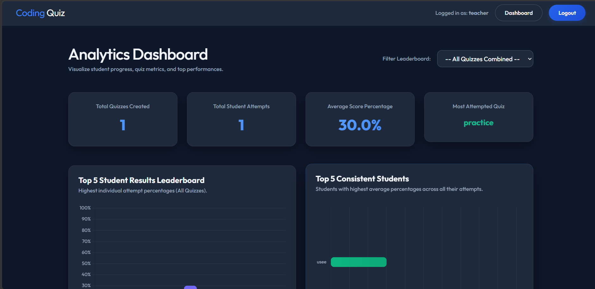

# Web-Based Assessment System with Role-Based Access Control


A comprehensive, full-stack assessment platform built with Django. This application allows educational institutions or organizations to create dynamic quizzes, evaluate users, and view detailed analytics, all managed securely through Role-Based Access Control (RBAC).

## ✨ Features

* **Role-Based Access Control (RBAC):** Distinct interfaces and permissions for different user types (e.g., Administrators, Instructors, and Students).
* **Dynamic Quiz Creation:** Instructors can easily build and manage quizzes.
* **Automated Scoring:** Instant grading and feedback for users upon quiz completion.
* **Analytics & Reporting:** Built-in tools (`analytics` and `reports` apps) to track student progress, average scores, and overall performance.
* **Secure Authentication:** Robust user authentication system to ensure data privacy.

## 📸 Screenshots

### Teacher Dashboard


### Create Quiz Interface


### Student Dashboard


### Analytics Dashboard


## 🛠️ Tech Stack

* **Backend:** Python, Django 6
* **Database:** SQLite (default for development)
* **Frontend:** HTML, CSS, JavaScript (Django Templates)

## 🚀 How to Run Locally

Follow these steps to run this project on your local machine.

### Prerequisites
* Python 3 installed on your machine
* `pip` (Python package installer)

### Installation

1. **Clone the repository:**
   ```bash
   git clone https://github.com/15Pratham/Web-Based-Assessment-System-with-Role-Based-Access-Control-.git
   cd Web-Based-Assessment-System-with-Role-Based-Access-Control-
   ```

2. **Create a virtual environment (recommended):**
   ```bash
   python -m venv venv
   
   # On Windows:
   venv\Scripts\activate
   # On macOS/Linux:
   source venv/bin/activate
   ```

3. **Install dependencies:**
   *(Note: Generate a `requirements.txt` file using `pip freeze > requirements.txt` if not already present)*
   ```bash
   pip install django
   # Or if requirements.txt exists:
   # pip install -r requirements.txt
   ```

4. **Run Database Migrations:**
   ```bash
   python manage.py migrate
   ```

5. **Create a Superuser (Admin account):**
   ```bash
   python manage.py createsuperuser
   ```

6. **Start the Development Server:**
   ```bash
   python manage.py runserver
   ```

7. **Access the Application:**
   Open your browser and navigate to `http://127.0.0.1:8000/`

## 🤝 Contributing
Contributions, issues, and feature requests are welcome!

## 📝 License
This project is open-source and available under the MIT License.
